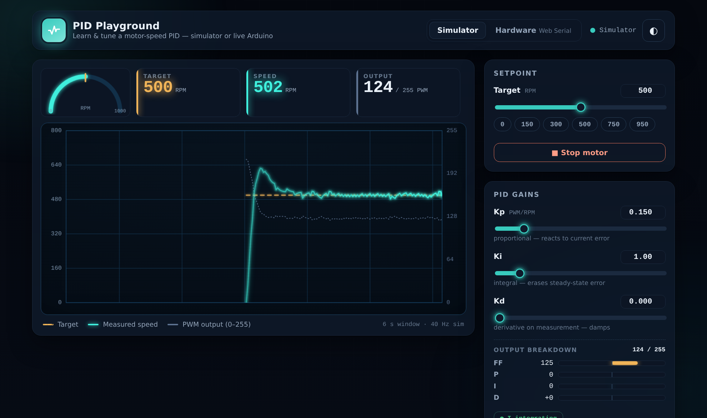

# PID Playground

**A browser-based tool to learn and tune a motor-speed PID controller.** Play with a built-in
gearmotor **simulator** (no hardware needed), or connect a **real Arduino over USB** (Web Serial)
and tune it live. One self-contained HTML file, zero dependencies, hostable free on GitHub Pages.



> Tuning a PID by typing serial commands and squinting at the Serial Plotter is painful, and
> measuring feed-forward is manual guesswork. PID Playground makes it **visual and interactive** —
> and because it ships a simulator, it's useful to anyone learning closed-loop control even without
> the exact hardware. Open the page → learn on a simulated motor in two minutes → plug in your
> Arduino → tune the real thing. No install.

---

## Quick start

**Just open it.** Double-click `index.html` (or serve the folder) and the simulator runs immediately —
no build step, no server, no network.

**Host the live demo on GitHub Pages:** push this repo, then in *Settings → Pages* serve from the
repository root. Your demo appears at `https://<your-user>.github.io/pid-playground/`. Because Pages
is HTTPS, **Hardware mode (Web Serial) works from the hosted URL** as well as from `localhost`.

---

## What you can do

### 🎛 Simulator mode (default — works in every browser)
A faithful gearmotor model driven by the **exact firmware PID**. Drag the sliders and watch the scope:

- **Setpoint** — target RPM, with quick preset chips and a **Stop** button.
- **PID gains** — `Kp`, `Ki`, `Kd`, live.
- **Feed-forward** — `offset` + `slope`. Match them to the motor (50 / 0.15) and feed-forward alone
  nails the target, open-loop — the whole point of feed-forward.
- **Measurement smoothing** — the EMA weight `S` that tames encoder quantization.
- **Output breakdown** — see exactly how much PWM comes from **FF / P / I / D**, and a live
  **anti-windup** indicator that lights up when integration freezes.
- **Scenarios** — apply/release a **load disturbance** (watch the speed sag and the integral recover),
  reset the run, or restore defaults.
- **Auto-measure feed-forward** — briefly sweeps the motor open-loop, fits `PWM = offset + slope·RPM`
  by least-squares, and sets the FF sliders for you.

### 🔌 Hardware mode (Chrome / Edge desktop)
Connect an Arduino running [`firmware/v1.ino`](firmware/v1.ino) over Web Serial:

- Parses the board's telemetry and plots it on the same scope.
- `Kp` / `Ki` / `Kd` / target sliders send commands live (debounced); **Stop** sends `s`.
- The **feed-forward and smoothing sliders are disabled** in Hardware mode — the stock firmware has no
  command for them (they're compiled-in constants). See the [roadmap](#roadmap) for the enhanced
  firmware that unlocks them.

---

## Browser support

| Feature | Requirement |
|---|---|
| Simulator | Any modern browser (desktop or mobile) |
| Hardware mode | **Chrome or Edge on desktop** — [Web Serial](https://developer.mozilla.org/docs/Web/API/Web_Serial_API) is Chromium-desktop only, and needs **HTTPS or `localhost`** |

If Web Serial isn't available the app says so and keeps the simulator fully working. Web Serial is also
blocked inside sandboxed iframes (e.g. a live-preview pane) — open the real page for hardware.

---

## The serial protocol

Baud **115200**, newline-terminated lines. This is the contract between the web app and the firmware —
[`firmware/v1.ino`](firmware/v1.ino) is the source of truth.

**Telemetry** (printed ~40×/sec, one line per control tick):

```
SP:<target>,RPM:<speed>,OUT:<pwm>
```

With raw debug enabled (`r`), three fields are appended and safely ignored by the parser:

```
SP:400,RPM:398,OUT:110,dCounts:12,A:1,B:0
```

**Commands** (each terminated with `\n`):

| Send | Effect |
|---|---|
| `<number>` | set target RPM (0–1000) |
| `s` | stop the motor (target 0, clears the integral) |
| `p <value>` | set `Kp` |
| `i <value>` | set `Ki` |
| `d <value>` | set `Kd` |
| `r` | toggle raw encoder debug fields |

---

## The control law

The simulator replicates the firmware **exactly**. Per 25 ms tick (40 Hz):

```
rpmRaw     = |counts| / 70 / dt * 60                 // encoder → RPM
rpm        = S*rpm + (1-S)*rpmRaw                     // EMA smoothing (S = 0.6)
error      = target - rpm
derivative = -(rpm - rpmPrev) / dt                    // derivative ON THE MEASUREMENT (no kick)
feedForward = target>0 ? (offset + slope*target) : 0

output = feedForward + Kp*error + integral + Kd*derivative
if (output > 0 && output < 255) integral += Ki*error*dt   // conditional-integration anti-windup
integral = clamp(integral, -255, 255)
output   = feedForward + Kp*error + integral + Kd*derivative   // recompute
output   = clamp(output, 0, 255)
if (target <= 0) { output = 0; integral = 0 }             // stop resets the I memory
```

**Defaults:** `Kp 0.15`, `Ki 1.0`, `Kd 0.0`, `FF_OFFSET 50`, `FF_SLOPE 0.15`, `SAMPLE_MS 25`,
`RPM_SMOOTHING 0.6`, `PWM_MAX 255`, `COUNTS_PER_OUTPUT_REV 70`.

The teaching points the UI makes visible: **feed-forward does most of the work**, the **integral erases
the leftover**, **anti-windup** freezes integration at the limits, **derivative-on-measurement** prevents
kick on setpoint changes, and **smoothing** tames encoder quantization. There's a wiring + deeper PID
explainer in [`docs/wiring-and-pid.html`](docs/wiring-and-pid.html).

---

## The hardware it mirrors

Arduino **UNO + L298N** driver + **REV HD Hex** motor (5:1 gearbox) + **quadrature encoder**, running a
closed-loop RPM controller (feed-forward + PID with anti-windup). The firmware streams telemetry and
accepts serial commands; PID Playground is its companion UI and a standalone teaching sim. Pin map and
wiring are documented in the firmware header and the wiring page.

---

## Project structure

```
pid-playground/
├─ index.html              # the whole app (MVP, zero dependencies)
├─ README.md               # this file
├─ LICENSE                 # MIT
├─ firmware/
│  └─ v1.ino               # the Arduino sketch it talks to (protocol source of truth)
└─ docs/
   ├─ wiring-and-pid.html  # wiring + PID explainer page
   └─ screenshot.png       # README image
```

---

## Roadmap

Post-MVP ideas, roughly in order:

1. **Enhanced firmware** adding serial commands `o <FF_OFFSET>`, `f <FF_SLOPE>`, and a `sweep`/`autotune`
   routine — unlocks the FF sliders and one-button characterization in Hardware mode.
2. **PID auto-tune** (step-response fit or relay / Åström–Hägglund) with a "Tune for me" button.
3. **Shareable presets** — encode gains + target in URL params.
4. Extract the controller into a reusable **`VelocityPID` Arduino library** (feed-forward + anti-windup +
   encoder helper + stall guard), publishable via the Arduino Library Manager.

---

## License

[MIT](LICENSE) — do anything, no warranty.
